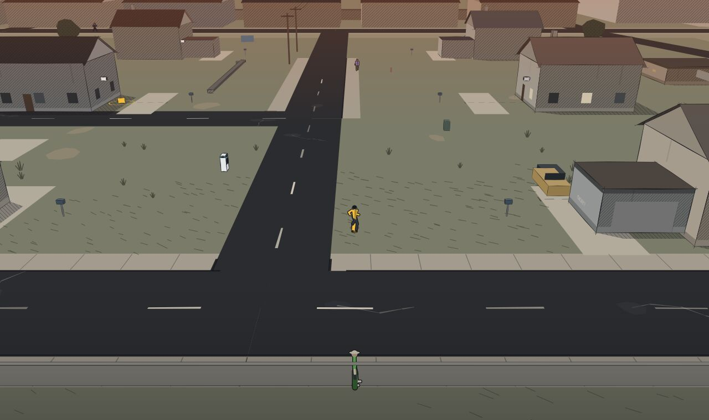
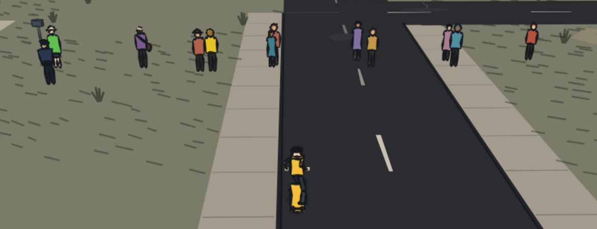
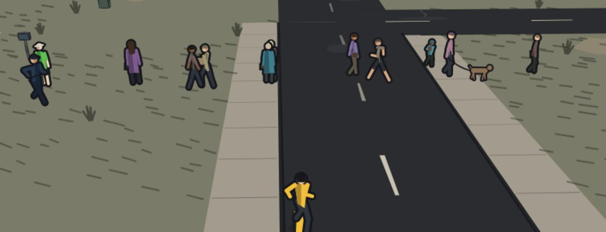
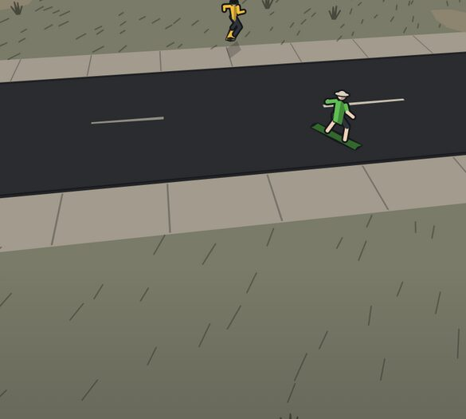
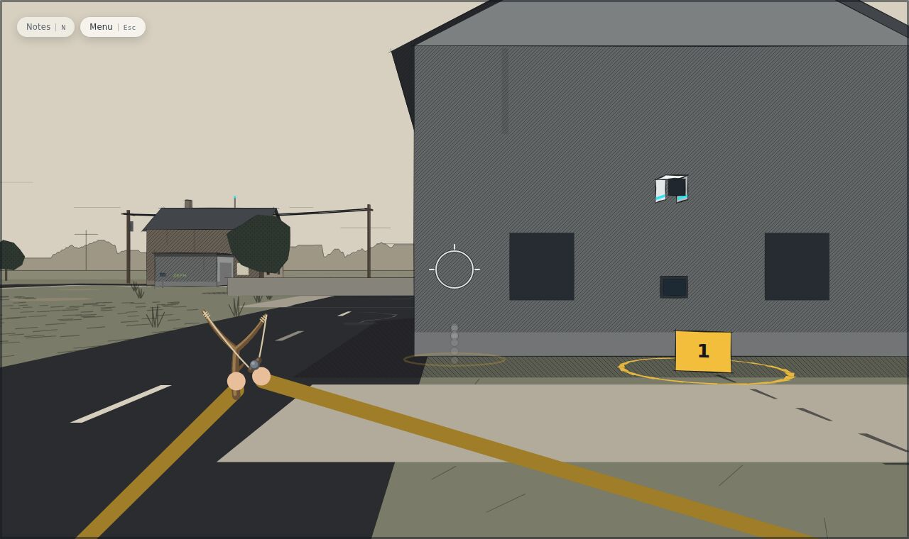
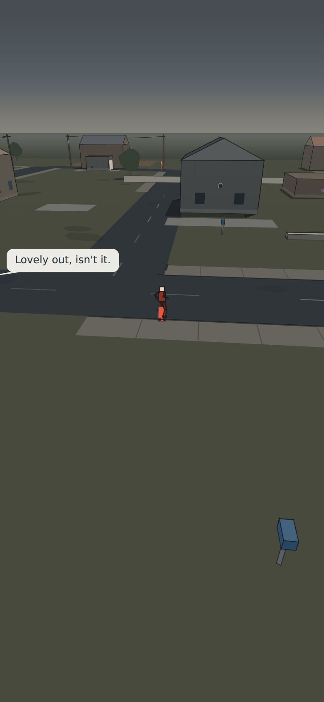
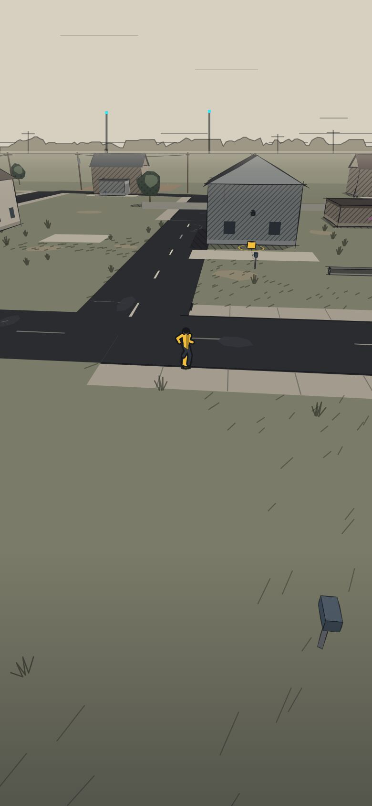

# 40 — The Inked Town

The visual identity, first original pass. This supersedes the palette, light
and character sections of [39 — Near-Future Urban Noir](39-near-future-urban-noir.md)
(§3, §4 "noir correction", §6) for the **street view** — the chase camera and
first-person aim. The plan view and machine vision are unchanged; they are the
system's register and are meant to look like a different product. Everything
in 39 about SAFEtrace hardware, the record UI and the dressing rules stands.

It is an exploration on a branch. Nothing here is final art, and §9 lists what
final art would still need.



## 1. The direction in one line

**A hand-inked investigative skate world that happens to be interactive.**
The town is printed — ink on paper, a few flat washes between them,
screentone where a graphic novel would put it — and the player's
investigation is drawn into it in their own amber pencil.

The noir pass made a low-poly town darker. This pass stops treating the town as
lit 3D at all: geometry stays simple underneath, and the rendering makes that
simplicity look intended.

## 2. The visual language

### Paper and ink
- **The sky is the page.** Unprinted paper (`PRINT.paper`), with a few broken
  ruled strokes that close up toward the horizon and slide as the rider turns.
  No gradient, no fog.
- **A printed skyline** rings the horizon past the modelled town: roofs,
  trees, a pole line and the odd relay mast, inked flat against the paper, on
  fixed compass bearings. A relay mast carries one cyan point — the system's
  colour, and the only colour in the backdrop. On an upright phone the camera
  keeps a third of the glass above the horizon; this is what fills it.
- **Distance is less ink.** The far town fades back toward the paper (lightly
  — a heavy wash read as fog and was cut back twice), and lines break up with
  distance rather than thinning to hairlines.
- **The near ground falls into ink.** A low wash at the bottom of the frame
  keeps the light on the rider and reads better under the thumb controls.

### Value structure
Three values do most of the work, the way they would in a printed panel:

| | Value | What |
|---|---|---|
| Ink | darkest | the road, kerbs, outlines, glass, shadow hatching |
| Wash | mid | verges, lit walls, roofs, trees |
| Paper | lightest | the sky, footways and forecourts, lit windows |

Skateable ground (footway, forecourt, tile) is always lighter than the verge
beside it (tested): the surfaces you can ride are the inviting ones.

### The road is scratchboard
The road is the darkest shape in the street, so its wear is drawn the way a
scratchboard artist draws on black: a patch of newer tar a shade lighter, the
crack under it scratched out in a jagged paper line, and lane paint that is
hand-laid — each dash a little off line, uneven in width, some half gone.

### Ground marks, selectively
- **Grass** is short pen strokes laid in one direction, in drifts decided by a
  low-frequency field, anchored in the world so they foreshorten like the
  ground does. Most of a lawn is left alone.
- **Tufts** stand up along the edges of verges, irregularly spaced.
- **Worn ground** is paler bare earth, never a darker blotch.
- **Kerbs** are a solid ink line.

### Light is drawn, not shaded
A wall the sun reaches is a flat wash of its own colour. A wall it does not is
the same colour taken down hard with **diagonal hatching** over it. Cast shadows
are a flat ink wash with **cross-hatching**, one convex shape per building.
Tree crowns are a dark mass under a **dot screen** with one lit mass on top.
These three tones (`tone.ts`) replace every gradient the street used.

### Architecture with a silhouette
Same footprints, same heights, same collision — but:
- pitched roofs **overhang** the walls at the eaves and gables, with the pitch
  varied house to house;
- most houses carry a **chimney** astride the ridge;
- flat-roofed blocks get a dark **coping band**, which is their roofline from
  the far end of the street;
- walls are mid-value materials (render, block, brick, siding, timber) so ink
  reads on them, with windows and doors inked at detail weight;
- lit windows are left as **paper**, not lamp-yellow (that hue is the
  player's).

### Infrastructure
Poles are a little taller and heavier in the crossarm than life, with
insulators near the eye — the pole line is the street's rhythm on a phone.
**Wires are hairlines at every distance** (each piece sized by its distance
from the eye; in metres they became a black bar across the glass whenever the
rig swung under one). Street blades, bins, a dulled hydrant, a dulled cone and
the post box all come from the print palette.

## 3. The ink

Linework is a hierarchy, not one outline (`ink.ts`):

| Class | Width at the eye | Breaks up past | Used for |
|---|---|---|---|
| Person | 2.3 px | never | people, the rider |
| Interactable | 1.9 px | 90 m | cameras, cabinets, drones, evidence markers, the ammo cache |
| Building | 1.7 px | 75 m | walls, roofs, chimneys |
| Furniture | 1.15 px | 50 m | poles, signs, trees, bins, fences, props |
| Detail | 0.8 px | 30 m | windows, doors, shopfronts |
| — | none | — | wires, grass, ground marks, lights |

Each edge is a **brush stroke**: tapered at both ends, full width through a
middle nudged off true, heavier where "the hand pressed", and on architecture
carried a little past the corner the way a draughtsman's line overshoots. Far
off, a line drops strokes and shortens others instead of thinning.

The wobble is **seeded from the thing, never the frame**: from world position
for static geometry, and from identity for anything that moves (a person's
line is theirs and does not boil as they walk). A test calls the brush twice
and requires the same path.

## 4. Colour

### Three meanings (`SIGNAL`)
```
Player   amber   #F2BE3C   the rider, the board, the flow ring, the player's own marks
System   cyan    #2FE3F2   SAFEtrace, the plan, the relay masts
Warning  orange  #FF6326   a camera that has you, an officer responding
```
These are sacred, and two fixes made them so:
- The noir pass's amber (`#E8A33D`, hue 36°) and warning orange (`#FF8B2B`,
  27°) were **nine degrees apart**. Amber moved toward yellow (43°) and warning
  toward red (17°); the tests now require at least 22° between any two.
- The rider was red, a camera that had you was the rider's red, an officer
  responding was amber, and a camera turned toward your noise was another
  amber. Now: the rider is amber; a camera that **has you** is warning orange;
  a camera turned to **your stone's noise** is your amber (it is your doing);
  an officer **responding** is warning orange, and **intervening** a true red.

### The environment (`PRINT`)
Every street colour lives in `PRINT` or in `weather()` over authored paint.
Tests hold all of them, plus every building material, to two rules: **chroma
below 0.25**, and **chroma below 0.15 within 25° of any signal's hue**. That
second rule caught a lamp-yellow lit window, the cone and two shop fronts on
the way in; it is why the hydrant is a dull oxblood and the cone a faded
terracotta rather than red and orange.

### People
People keep their saturation — they are meant to be the warmest things in the
frame — and residents now vary in skin tone and trouser colour per person. The
rider wears an amber hoodie, dark trousers and a dark beanie: from the chase
camera the back of the head and the top half are most of the silhouette.

## 5. People: posed, dressed and inked

The first pass of this document drew people as flat cut-outs facing the lens:
no arms, no stride, every passer-by the same adult, the rider a scribble of
sticks. That was the weakest thing in the frame and it is replaced
(`characters.ts`), with one system for everybody on the street, the rider
included.

| Before | After |
|---|---|
|  |  |

- **A skeleton in the world.** Hips, knees, feet, shoulders, elbows, hands
  and head are placed in three dimensions, facing where the person is
  actually heading, and posed by gait: standing with the weight on one leg,
  walking (opposite arm and leg, the coming-through foot lifted), running
  (leaning in, arms bent), riding (across the board, knees bent, arms out,
  looking down it). Stride is driven by distance actually covered, so feet
  don't slide. Knees and elbows come from the same two-bone solver the rider
  has always used.
- **Kinds are drawn as kinds.** The simulation always knew who was a child,
  a jogger or a dog walker; now the picture does too. A child is two-thirds
  height with a bigger head and a backpack; a jogger runs in a tee, shorts
  and a headband; a dog walker has a dog on a lead, trotting.
- **Looks.** A garment with its own outline (long coat, dress, apron,
  uniform, cardigan, hoodie, long tee), a hat that is a shape (bucket,
  peaked, brimmed, beanie, cap, hood, headband), hair that covers more of the
  head from behind than in front, and what they carry (bag, satchel and
  strap, handbag, parcel, board).
- **The named cast are themselves.** Mara in a work apron with her hair tied
  up; Priya in a long tailored coat with a lanyard badge in the system's own
  cyan — the only person in town who wears it; the courier in a cap with a
  parcel in both hands; Mrs. Carvalho a little stooped with a handbag;
  Mr. Brennan in a long coat and a brimmed hat.
- **Devon** has the only bucket hat in town (tested), pale against
  everything, a long green tee and shorts, and his board in his hand when he
  is not on it.
- **The officer** is the broadest figure on the street (tested), belted, in a
  peaked cap — and his hands act: one at the radio when **responding**, one
  held out flat when **intervening**. The shoulder light sits on top.
- **The rider** keeps every bit of its own animation (push, carve, pop,
  flip, grab, the sling); only the drawing changed. Amber hoodie, dark
  trousers, dark beanie, light shoes; from the chase camera the head looks
  down the board, so you see the back of the beanie, not a face.
- **Ink, the way a person is inked.** One heavy outline round the whole
  figure first, so the silhouette is one shape; colour inside it; a thin line
  only where a near arm crosses the body. Torso and head are split into a lit
  and a shadow side by the town's sun. Under about 30 px tall a figure drops
  hands, shoes, straps and face marks — detail that would only be specks.
- **Clothes can't be signals.** Several authored colours (a mustard coat,
  two rusts, the courier's yellow, Mara's shirt) sat within a few degrees of
  amber or warning orange, and on a 20 px figure hue is read first: the
  courier read as a second player. Clothing near either hue is desaturated
  toward its own grey (`wearable()`, tested); the rider is the only amber
  figure in town.

A whole person is one entry in the depth sort, placed where they stand, that
paints itself — so no part of a person can sort behind another part of them.



## 6. Evidence as visual language

The street carries the player's investigation, in the player's amber and the
player's hand (`evidence.ts`), and only once they have earned it:

- **A numbered evidence marker** — the folding tent a scene examiner puts down
  — stands beside every place the player has looked at, numbered in the order
  they found them. A **pencil ring** is drawn round it on the ground: a
  hand-drawn circle that does not quite close. A place that would read
  differently now (a second look) gets the ring twice.
- **A ruled sightline** — dashed ink with a tick across the end — lies on the
  ground in front of every camera the player has noticed, turning as the
  camera sweeps. Cameras nobody has noticed have none.

The town looks more mapped the more of it you have worked out, and none of it
is HUD: it is drawn in the world and sorts with it. SAFEtrace's own picture is
still the plan, in cyan; this is the kid's, on the street, in pencil.



## 7. Architecture

### What the brief asked to separate
Gameplay foundation and presentation are separate. **No simulation file was
touched**; `src/sim` still imports nothing from `render` (tested).

### New modules (`src/render/`)
| File | Owns |
|---|---|
| `ink.ts` | the line hierarchy table, the brush stroke, the seeding |
| `tone.ts` | the three screentones, built once per canvas at device resolution |
| `characters.ts` | people: pose by gait, the catalogue of looks, the figure and dog painters |
| `evidence.ts` | which markers and sightlines the street shows (pure, tested) |
| `palette.ts` | adds `SIGNAL` (the three meanings) and `PRINT` (the street) |

### Changed
- `perspective.ts` — consumes all of the above. Faces carry an ink class, an
  optional tone and a stable seed. The draw loop is fill → tone → decals →
  brush ink. New: paper sky and skyline, the ground pen pass, evidence,
  people as self-painting faces with a stride tracker, eaves, chimneys,
  coping, hull shadows, back-face culling.
- `renderer.ts` — passes the places the player has seen to the street view;
  routes "a camera has you" and an intervening officer in the plan through
  `SIGNAL.warning`. No layout or logic change.
- `machine.ts` — the listening-camera glow uses `SIGNAL.player`.
- `styles.css` — `--st-orange` follows the new warning orange.
- `main.ts` — a dev-only `window.__safetrace` handle for the screenshot
  harness. Vite strips it from production builds.
- `scripts/shots.mjs` — the harness: boots the dev build, skips the
  advertisement, hides every piece of HUD, frames the slice at 390×844 and
  1280×760, and measures world-draw cost with and without 4× CPU throttling.
- `scripts/lineup.mjs` — stands one of every kind of person, the named cast,
  the officer and Devon in a row in front of the rider, for character work.

### Not changed
Gameplay, simulation state, collision, sightlines, the camera (height,
distance, lens, follow), controls, the plan view, machine vision, the record UI.

## 8. Results

### Mobile readability (390×844, HUD hidden)
| Before | After |
|---|---|
|  |  |

- The rider reads first in every frame: amber against a black road.
- Devon reads as Devon at the far end of Maple Court by his hat alone.
- Officer vs resident reads by colour and by outline (peaked cap, the
  broadest shoulders, a belt), and his hands say what he is doing.
- Children, joggers and dog walkers read as what they are at the chase
  camera's distance.
- The evidence tent reads as an amber marker at 40 m; its number reads close
  up. The pencil ring reads from the chase camera.
- **Weakest at phone scale:** the bottom 40–45% of an upright frame is ground
  behind the rider (the camera's composition — see §10). The ink vignette and
  grass drifts make it quieter rather than interesting.

### Performance (median world-draw time per frame, same session)
| | Baseline | Inked town |
|---|---|---|
| Phone viewport | 3.8–4.4 ms | 4.5–4.6 ms |
| Phone, CPU throttled 4× | 18.2–22.6 ms | 21.6–23.6 ms |
| Desktop | 4.0 ms | 4.1–4.7 ms |
| Desktop, 4× | 18.1–20.0 ms | 20.2–21.7 ms |

Faces per frame went *down* (≈1,250–1,390 → ≈1,020–1,050). Three things paid for the
ink: back-face culling of walls and box sides (hidden faces were being filled,
hatched and inked, then painted over), drawing grass as a direct stroked pass
after the ground rather than as sorted faces, and one hull shadow per building.
One idea was measured and **reverted**: batching ground marks into one path
made paint twice as slow in Skia.

The character system was measured separately: painting every person costs
about 0.7 ms a frame with 9–13 people in view, and the committed street before
it and after it measured the same within noise when run interleaved in one
session (6.1–6.4 ms against 6.1–6.3 ms on a machine that was slower that day
than for the table above).

## 9. What is still scaffolding

- **All geometry.** Footprints, extrusions and boxes are the prototype's. The rendering makes them read as drawn; it does not make
  them designed.
- **Characters** are procedural: posed skeletons with drawn volumes, not
  authored art. There are no faces beyond a brow and a nose close up, no
  expressions, hands are dots, and the walk is one cycle for everybody.
- **The screentone is screen-space.** On a page that is invisible; in motion
  the tone stays put while walls slide under it ("shower door"). At this pitch
  it reads as print. If playtests say otherwise, world-anchored hatching on
  walls is the fix, at some cost.
- **The skyline** is procedural, not Bellhaven's actual horizon.
- **Text** on signs is set in the UI face, not lettered.

## 10. What the final art direction still needs

1. **Character art.** The system now poses, dresses and inks everybody;
   what it needs from an artist is per-character design — model sheets for
   the rider, Devon, Mara, Priya and the officer, faces for close-ups and
   conversations, and walks with personality rather than one shared cycle.
   The look catalogue in `characters.ts` is where that design would land.
2. **Authored buildings.** A small kit of facade types per district — the
   parade, the terraces, the school, the depot — rather than one
   extrude-and-dress routine. Porches, bay windows, shopfront depth.
3. **Lettering.** Hand-lettered signs, tags and street blades.
4. **Evidence, further.** Annotated signs, a hand-drawn arrow between two
   places the notes have connected, visual repetition the player can learn
   to spot. The hooks exist (`evidence.ts`); the content does not.
5. **Skate lines.** Ledges, banks and kerb cuts drawn so the skateable reads
   as placed: a worn wax mark on a ledge, a scuffed kerb edge, grind marks.
6. **Camera (a design consideration, not changed here).** On an upright phone
   the chase camera spends about 38% of the frame above the horizon and 40–45%
   on ground behind the rider. The skyline and the vignette make that space
   work; a camera that put the rider lower and showed more street ahead would
   give the art more to do. Worth trying against the readability gate in
   [31](31-vertical-slice-feel-and-the-playtest-gate.md) — the same
   recommendation as [39](39-near-future-urban-noir.md) §8.
7. **The plan view** should eventually be cartography in the same hand — the
   town's map as drawn by the kid — without losing the machine's register
   when VISION is on.
8. **App icons** still carry the old teal (39 §9).

## 11. The screenshot test

With the HUD hidden, a frame is SAFEtrace if it has: **paper sky over an inked
skyline with one cyan point in it; a black scratchboard road; hatched walls;
an amber kid on a board; and, once you have played a while, amber pencil in the
street where you have been looking.**

More frames: [phone, Devon down the street](art/40/after-phone-maple-devon.jpg) ·
[phone, the terraces and an officer](art/40/after-phone-officer.jpg) ·
[desktop, the terraces](art/40/after-desk-officer.jpg) ·
[before](art/40/before-desk-maple-back.jpg) / [after](art/40/after-desk-maple-back.jpg) desktop.
