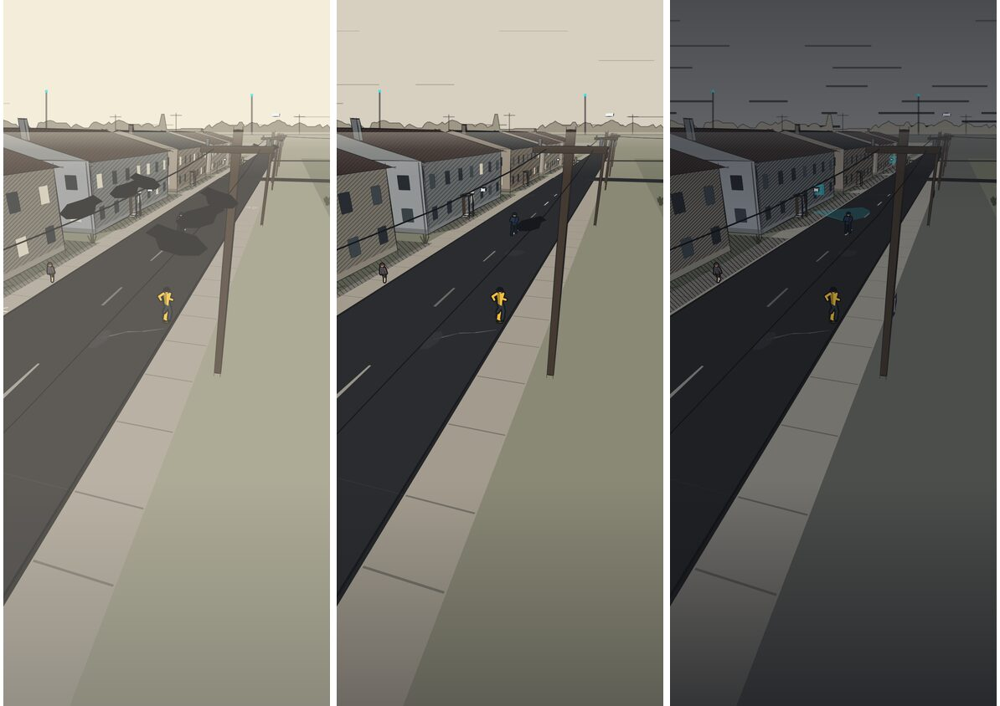
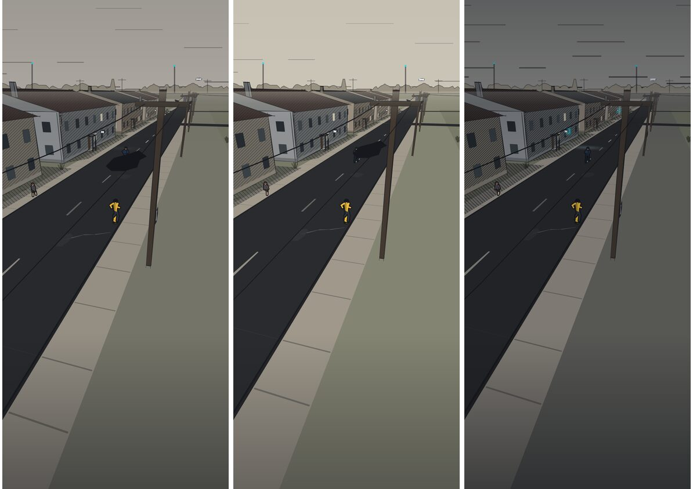

# 41 — The Mood of the Town

The inked town ([40](40-the-inked-town.md)) was one afternoon, drawn once.
This pass makes the picture answer the game: **the more the surveillance
state has control, the darker and more sinister the town; every bit of
sabotage and uncovering brightens it.** It also adds a layer of drawn
detail the street was short of — porches, drainpipes, aerials, birds, chalk.

Nothing in the simulation changed. The mood is read from it, never written
to it, and a tested module says so.

## 1. The mood, as a number

`src/render/mood.ts` reads the simulation into two quantities pulled against
each other, and the art reads their difference:

| | What it is | Read from |
|---|---|---|
| **Grip** | the system's hold on the player *right now* | risk score (45%), escalation ladder (25%), scrutiny where they stand (20%), a lens on them now, units responding |
| **Cut** | what the player has taken from the system *over the afternoon* | nodes looped, tampered or down (the big lever, 55%, on a square root so the first one counts most), cameras noticed (20%), clues written (20%), VISION (12%) |

`control = START + grip − cut`, clamped to −1..1. Grip rises in a moment and
falls back as the town forgets; cut only grows. So an afternoon of sabotage
keeps the town lit even while the player is being chased through it.

### The town begins partially owned

**The player's job is to peel ownership away.** A fresh afternoon starts at
`START = 0.32`: the sky already a shade toward slate, SAFEtrace's plates on
about a third of the poles, the lenses faintly glowing, a cold patch of light
under each one. Not dark — there is somewhere for pressure to go — but
plainly not the kid's town yet. The loop the numbers are set for is

> **pressure → identify → sabotage → relief → deeper infiltration**

- **Pressure**: being noticed raises grip, and the town closes in.
- **Identify**: noticing cameras and writing clues lowers control a little,
  steadily.
- **Sabotage → relief**: the first node looped is the biggest single step
  the player can take (the square root on sabotage makes the first one
  count most). From a fresh afternoon it alone takes the town most of the
  way back to ordinary: the plates come off most poles, the lens glow and
  the cold patches fade, the sky lifts to paper.
- **Deeper infiltration**: each further node is worth less than the first,
  but understanding keeps compounding, and only a sustained run of both
  takes the town past ordinary into lit.

Relief is quick and pressure creeps: the renderer eases toward a *lower*
control in about half a second and toward a *higher* one over nearly two,
so a sabotage lands as a moment and being found out is a slow closing-in.
Tests hold the start state, the size and order of the steps in that loop,
the direction of every input, the bounds, and that reading the mood changes
nothing in the simulation.

## 2. What darkens

Owned (control → +1). Structure first, wash second — the brief's warning
against "simply desaturated 3D" applies to this pass more than any other.

- **The page.** The paper goes down toward a cold slate; the ground past the
  modelled edge with it.
- **The sky.** More rules, closer together, heavier and darker: a low lid.
- **Watched ground is colder.** Every working camera throws a faint pool of
  cold, paper-white light onto the ground in the direction it faces, the
  way an infrared lamp under a housing lights a patch of pavement — faintly
  warm for the one that has you. No edges, no outline, five soft rings for a
  falloff: a player who looks learns to see which patches of street are
  watched; one who doesn't only feels that the town is. (The first version
  drew hard cyan wedges here, which read as UI; they are gone.)
- **Every lens glows.** A soft cyan halo on each working camera: in the dark
  the cyan points are the first thing you see, and they are everywhere.
- **SAFEtrace's plates go up on the poles.** A white plate with the wordmark
  and one cyan band at head height, first on one pole in ten and then on
  most of them, chosen by hash so they come up in a stable order.
- **The town goes dark around the few who are home.** Most windows are
  dark, but rooms with somebody in them and shops that are open hold their
  light, and spill a soft pool of paper-white onto the ground in front —
  never lamp-yellow, which is the player's hue. Few, low and soft: the town
  should feel watched, not decorated.
- **Hoods go up.** More residents walk with their hoods up and heads down.
- **Shadows lengthen** — the same sun, later in the day.
- **The birds leave.**
- **The tags are painted out.**
- **The tone goes denser:** a finer, heavier hatch on walls, shadows and
  trees past control 0.45.
- **Then the wash.** A multiply wash in a cool grey over the whole page, and
  ink closing in from the top and bottom edges. Never more than a tint; it
  agrees with the structure rather than carrying it. The rider is in the dark
  with everything else — that is what being owned looks like — and stays
  the warmest thing on the page.

## 3. What brightens

Lit (control → −1):

- **The page warms and lightens**, and a thin warm screen lifts every wash.
- **Fewer, fainter sky rules.**
- **More rooms have somebody home:** the dark panes that might have been
  lit, are.
- **The birds come back,** more of them, on every wire.
- **Chalk on the pavements:** hopscotch grids and suns with rays, in pale
  chalk on the footways, drawn only while the mood is on the kid's side.
- **The tags are louder.**
- **The edges open up:** the bottom vignette eases off.
- **Nothing of the system's is drawn** beyond its hardware: no cones, no
  plates, no halos. The kid's own amber pencil (evidence markers, ruled
  sightlines) is what is left on the street.

## 4. Detail, regardless of mood

Added to every building and street for character:

- **Porches:** a step up to each house's front door, and a canopy on two
  posts over it.
- **Drainpipes** down one end of most walls, inked.
- **TV aerials** lashed to a third of the chimneys.
- **Birds** on the wires (mood decides how many).
- **Chalk** sites authored into the street dressing (mood decides whether
  they are drawn).

## 5. Architecture

- `src/render/mood.ts` — `readMood(sim)` → inputs, `moodFrom(inputs)` →
  `{ grip, cut, control }`, both pure; `moodOf(sim)` is the pair. Tested in
  `tests/mood.test.ts`.
- `renderer.ts` — computes the mood each frame, eases it, hands it to the
  street view. `moodOverride` lets a harness pin it.
- `perspective.ts` — `pageFor(control)` turns the mood into the page (paper,
  rules, wash) once per frame; every cue above reads `this.page`. Window and
  tag decals carry flags (`lit`, `tag`) and are resolved at collect time.
  Street dressing gains `chalk`; buildings gain `porch` and `aerial`.
- `tone.ts` — a `dense` variant of each screentone, cached alongside.
- `scripts/shots.mjs` — `SHOT_MOOD=-1..1` pins the mood for a capture;
  `SHOT_ONLY=1` captures just the two most useful frames.
- No file in `src/sim` changed. No gameplay, simulation state, collision or
  camera change.

## 6. Results

Performance (median world-draw time, run alone, same session):

| | Phone | Phone 4× | Desktop | Desktop 4× | Faces |
|---|---|---|---|---|---|
| Base (40, merged) | 6.7–7.1 ms | 33–36 ms | 6.8 ms | 34–35 ms | 990–995 |
| Ordinary (0) | 7.1 ms | 35.8 ms | 7.3 ms | 36.1 ms | 1,071 |
| Owned (+1) | 6.9 ms | 35.6 ms | 7.9 ms | 36.6 ms | 1,106 |
| Lit (−1) | 7.4 ms | 37.7 ms | 8.9 ms | 39.1 ms | 1,170 |

The machine these were taken on ran about 50% slower than the one in
[40](40-the-inked-town.md)'s table all day, so only the rows against each
other mean anything; the base row is the merged branch measured the same
way, in the same session, minutes apart.

Against the base: about 5% more in the ordinary state (the porches,
drainpipes and aerials, and the per-frame page), the same when owned, and
5–10% more when lit (chalk and birds). Faces per frame rise by about 80 in
the ordinary state and 100–180 at either end of the mood.

Local light and the start state, measured alternately against the merged
mood pass on the same machine (slower again that day): phone median 8.4–8.5 ms
against 7.9–8.9 ms, and about 10% more at 4× throttle. About 130 more faces
in the start state: the pools, the plates on a third of the poles, the lens
glow.

## 7. Still to do

- **Light is not occluded by people.** The pools are drawn on the ground
  layer, so buildings in front of them hide them correctly, but a person
  standing in one is not lit by it. A rim of light on a figure standing in a
  pool would be the next step.
- **Sound** does not know the mood. The audio layer reads the same bus; a
  lower, emptier mix in an owned town is the obvious pair to this.
- **The plan view** is unchanged, and should probably not change: it is the
  system's register, and the system's picture of the town does not get
  darker when the system is winning.
- **People** could do more than put their hoods up: walk faster, stop
  talking, cross the road. That is simulation, and belongs to it.
